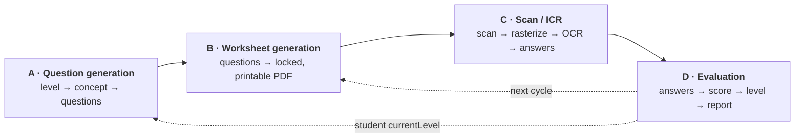

# Product Pipelines

The four end-to-end pipelines of the FLN platform, described as they are implemented today. Each section states purpose, input, processing steps, the modules involved, what the LLM does, what is deterministic, output, dependencies on the other pipelines, implementation status, and known gaps.

**CURRENT** means it runs in the backend today. **PLANNED / NOT WIRED** means the code exists but nothing calls it, or the research specifies it and it is not built. The two are labelled separately throughout, because a lot of this codebase has readable, plausible, unwired code sitting next to the live path.

Companion documents: [ARCHITECTURE.md](ARCHITECTURE.md) (system shape) · [AGENT_ARCHITECTURE.md](AGENT_ARCHITECTURE.md) (what the AI may decide) · [SRS.md](SRS.md) (requirements) · [CLAUDE.md](CLAUDE.md) (working rules) · [`ai-services/PIPELINE.md`](ai-services/PIPELINE.md) (the legacy Python pipeline, for reference — it is not invoked by the backend).

> **Read the caps first.** The curriculum taxonomy is 93 levels (SRS §1.8), but the worksheet renderer in `backend/fln-backend/` still implements the retired 1–59 space, so a recommended level is capped at **59** and levels 60–93 are not renderable yet.

---

## Pipeline overview



| | Pipeline | Entry points | Primary owner |
|---|---|---|---|
| **A** | [Question generation](#a-question-generation) | `POST /api/worksheets/generate`, diagnostic answer-key routes | `levelGenerator.ts` → `services/questionService.ts` → `utils/conceptQuestionGenerator.ts` |
| **B** | [Worksheet generation](#b-worksheet-generation) | `POST /api/worksheets/generate-pdf`, `generate-level-pdf`, `generate-level-batch`, `POST /api/diagnostic/bulk` | `paperGenerator.ts`, `backend/fln-backend/` |
| **C** | [Scan / ICR](#c-scan--icr) | `POST /api/icr/evaluate-cloud`, `POST /api/icr/evaluate-bulk` | `routes/evaluation.ts` + `ai-services/scripts/pdf_rasterize.py` |
| **D** | [Evaluation](#d-evaluation) | `POST /api/evaluation/submit`, `PATCH /api/evaluation/:reportId/override` | `routes/evaluation.ts`, `gemini.ts` |

---

## A. Question generation

### Purpose

Turn a curriculum **level** into a concrete set of questions for one student at one sub-level, so that the rest of the platform has something to print. This is the pipeline where the level framework becomes content.

### Input

| Input | Source |
|---|---|
| `levelNumber` (1–93) | the student's `currentLevel`, or the level a diagnostic targets |
| `subLevel` (0 / 1 / 2) | Mastery / Easier / Remedial |
| concept ID for the level | resolved from `backend/src/config/curriculumMap.ts` |
| class / cycle context | used by the calling route for locking and labelling, not by the generator itself |

### Processing steps (CURRENT)

1. `generateQuestionsForLevel(level, subLevel)` (`backend/src/levelGenerator.ts`) — the thin public entry point.
2. `QuestionService.getQuestionsByLevel(level, subLevel)` (`backend/src/services/questionService.ts`) — resolves the level to its Concept ID via the registry. An unknown level falls back to concept `S1.1`.
3. `generateQuestionsByConcept(conceptId, subLevel)` (`backend/src/utils/conceptQuestionGenerator.ts`) — emits **4 questions** per call in a `for (qIdx = 1; qIdx <= 4; qIdx++)` loop, dispatching on `conceptId` in a `switch`.
4. Each emitted `Question` is stamped with `question_id` (`<conceptId>_Q<n>`), `question`, `answer`, `answer_type`, `topic` (strand), `subtopic`, `difficulty`, `source_level`, `conceptId`, and optionally `svgAsset` / `choices`.

### Services / modules / files

| File | Role |
|---|---|
| `backend/src/levelGenerator.ts` | public entry point; delegates to `QuestionService` |
| `backend/src/services/questionService.ts` | level → concept resolution |
| `backend/src/utils/conceptQuestionGenerator.ts` | the actual question text/answer builders |
| `backend/src/config/curriculumMap.ts` | the level ⇄ concept registry this resolves against |
| `backend/src/gemini.ts` | `generateClassSpecificDiagnostic()` — a separate deterministic class-based generator (see below) |
| `backend/src/routes/questionTemplates.ts` | intent-based template authoring (**no consumer** — see gaps) |
| `backend/src/types/questionTemplateParams.ts` | template param typing |
| `backend/src/migrations/questionTemplateIntentV1.ts` | one-off migration that backfills an `intent` on existing templates |

### AI / LLM involvement

**None on the live path.** Question content is fully deterministic.

The Gemini-based generators exist but are **not wired**:

| Function | Status |
|---|---|
| `gemini.ts::generateAIDiagnostic()` | imports Gemini; on failure returns `generateClassSpecificDiagnostic()`. Imported by `index.ts`, **never called** |
| `gemini.ts::generateAIPersonalizedWorksheet()` | imports Gemini. Imported by `index.ts`, **never called** |
| `gemini.ts::generateClassSpecificDiagnostic()` | deterministic, class-group based. Reachable only as the fallback inside the uncalled `generateAIDiagnostic()` |

### Deterministic processing

- Level → concept resolution is a registry lookup keyed by level number. No level arithmetic, no name matching.
- Question text and answer are produced by hardcoded builders, parameterised by a seeded-free PRNG (`randomVal`) for numeric variants.
- `subLevel` selects the `subtopic` label and the `difficulty` field.
- Question identity is the concept ID, so the same concept always yields the same question IDs regardless of level renumbering.

### Output

An in-memory `Question[]` (4 items per call). Callers persist it as part of a `Worksheet` or use it to build an answer key. There is no separate question store written by this pipeline.

### Dependencies on other pipelines

- **Consumes from D:** the `levelNumber`. A student with no `currentLevel` cannot be given level-based content.
- **Feeds B:** B has no content source of its own — without A there is nothing to render.
- **Does not consume C or D's results directly.** It does not yet use the prerequisite graph to select which concepts to ask about (see gaps).

### Implementation status

**CURRENT, and the only live question source for the class-paper route.** `POST /api/worksheets/generate` calls `generateQuestionsForLevel(student.currentLevel, subLvl)` per student (`routes/worksheets.ts`). The diagnostic answer-key routes (`routes/students.ts`, `routes/diagnosticBulk.ts`) call it too, with `Math.min(lvl, 93)` clamping.

A **second, separate content path exists** and is easy to mistake for this one: `paperGenerator.ts::generateDiagnosticPaper()` sources its questions from a stored `masterJson` artifact (or a hardcoded fallback), **not** from the concept generator. So the ICR-facing diagnostic papers and the concept-generator class papers are built from different content.

### Known limitations and unfinished pieces

- **`questionTemplates` is not consumed — issue #486, "Generation pipeline must consume questionTemplates (intent-based authoring has no consumer)".** The authoring surface is real and complete: full CRUD, CSV import, a param catalogue, a level map, and an `intent` classifier. But the only callers of `getQuestionTemplatesByVariantKey()` are inside `routes/questionTemplates.ts` itself. Templates can be authored today and no child will ever see them. Do not describe template-driven generation as a feature.
- **Only 23 of the 93 concepts have authored builders.** The other 70 hit a `default:` branch that emits a placeholder string (`[Concept Sx.y] Level N Practice Question #k`) with the answer `k*10`. Generation "succeeding" for a level does not mean that level has real questions.
- **No graph-driven selection.** The research specifies that the prerequisite graph should drive *which* concepts a diagnostic selects, at worksheet-generation time (`Research/fln_level_networks.md`, method note). That is not implemented: questions come from the level, not from the graph. `competencyPrerequisites.ts` is currently consumed only for post-hoc explanation, in pipeline D.
- **No graph-driven difficulty mixing.** The research's item-budget and 50/35/15 difficulty mix are not implemented; every call returns the same 4 questions for a given `(conceptId, subLevel)`.
- **Not in the live path:** the Gemini generators described above.

---

## B. Worksheet generation

### Purpose

Turn questions into a printable, identifiable, scannable A4 paper for a class or a single student, under the generation-lock rules that decide who is allowed to print.

### Input

| Input | Source |
|---|---|
| `classId` + `cycle` | `POST /api/worksheets/generate` — one paper per class per cycle |
| per-student level + sub-level | student records, via pipeline A |
| `studentIds` | `generate-level-batch` — students who already have a `currentLevel` |
| a `masterJson` artifact | diagnostic-paper path, from the answer-key store |

### Processing steps (CURRENT)

1. **Authorise and gate.** In order: reject a banned Teacher (3 Delayed Attempts in the academic year) → reject a school with `isAccessLocked` (all teachers defaulted) → apply the two pairwise generation locks {Teacher ↔ School} and {Volunteer ↔ Block Admin} → enforce one generation per `(classId, cycle)`, returning **HTTP 423** on a re-trigger.
2. **Acquire the lock** and record it with the holding role, email, and timestamp.
3. **Generate questions** via pipeline A, per student.
4. **Render.** Two renderers, and the distinction matters:

   | Path | Renderer | Level space |
   |---|---|---|
   | `generate` / `generate-pdf` / `POST /api/diagnostic/bulk` | `paperGenerator.ts` — in-process Puppeteer, plus `worksheetRenderer.ts`, `pdfMerge.ts`, `qrCode.ts` | questions come from pipeline A; no level ceiling of its own |
   | `generate-level-pdf` / `generate-level-batch` | `backend/fln-backend/` — a separate Express + Puppeteer service, driven over HTTP by `levelsBackendClient.ts` (default `127.0.0.1:4000`) | **1–59 only**; throws `UnknownLevelError` above 59 |

5. **Stamp identity and the response layer.** A QR identity stamp is drawn onto the page (`qrCode.ts` → `drawQrCode()`), and an OMR overlay layer plus per-file OMR coordinates are emitted alongside the answer key, so pipeline C knows which sheet it is reading and where the response boxes are.
6. **Persist** a `Worksheet` record (one per class per cycle) and return the PDF or a batch manifest.

### Services / modules / files

| File | Role |
|---|---|
| `backend/src/routes/worksheets.ts` | gating, locking, orchestration for all `/api/worksheets/*` routes |
| `backend/src/routes/diagnosticBulk.ts` | bulk diagnostic paper generation + answer keys + progress/download |
| `backend/src/paperGenerator.ts` | diagnostic paper layout, `masterJson` handling, batching, ZIP |
| `backend/src/worksheetRenderer.ts`, `pdfMerge.ts`, `qrCode.ts` | render, merge, QR |
| `backend/src/paperLock.ts` | the finer per-`(studentId, paperType, cycle)` lock, applied only to `PAPER_TYPES_THAT_LOCK` so repeat-drill sheets stay repeatable |
| `backend/src/levelsBackendClient.ts` | HTTP client for the standalone renderer |
| `backend/fln-backend/` | the standalone renderer itself (worksheet + answer key + OMR coords, batch ZIP) |
| `frontend/public/worksheets/` | worksheet HTML templates, also read by the backend renderer |

### AI / LLM involvement

**None.** `generateAIPersonalizedWorksheet()` exists in `gemini.ts` and is not called. Every paper a child receives today is deterministically generated.

### Deterministic processing

- All gating and locking decisions.
- Question selection (pipeline A).
- HTML → PDF layout, QR stamping, OMR overlay, ZIP packaging.
- Batch manifests and the `skipped[]` list explaining which students were ineligible and why.

### Output

- A4 PDFs (per student or per class), a batch `batchId` with a downloadable ZIP, and `Worksheet` records carrying the lock, the cycle, and the class/school ids.

### Dependencies on other pipelines

- **Requires A** for content.
- **Requires D** indirectly: level-based sheets skip any student whose `currentLevel` is still `null` ("Student has not completed their diagnostic test"), so a class cannot run pipeline B's level path until D has run at least once.

### Implementation status

**CURRENT.** All five worksheet routes are registered and served.

### Known limitations and unfinished pieces

- **The 1–59 cap.** `backend/fln-backend/` cannot render levels 60–93, so the level-worksheet path is structurally limited to the legacy space while the taxonomy is 93. This is the 59→93 migration (SRS §1.8.4, `Research/fln_59_to_93_crosswalk.PROPOSED.md`).
- **A second renderer is a real operational cost.** The API depends on a separate process on `:4000` being up; there is no in-process fallback and no health check gating generation on it.
- **One paper per class per cycle** is a hard rule, not a default. Re-generating a Baseline paper requires a different route or an unlock, which surprises users who expect "regenerate" to work.
- **Content quality is uneven** — see pipeline A's 23-of-93 limitation, which applies to every paper produced here.
- **No adaptive mid-worksheet difficulty** — explicitly out of scope per SRS §1.5; the research's adaptive design is deliberately deferred to generation-time selection instead, which is itself not built (pipeline A).

---

## C. Scan / ICR

### Purpose

Turn a stack of scanned answer sheets into per-student answer JSON (`{"Q1": "A", ...}`) without a human keying them in.

### Input

| Input | Notes |
|---|---|
| scanned **PDF** | must be rasterized first — the vision endpoint accepts image MIME types only |
| scanned **JPEG/PNG** images | used as-is |
| the answer key / layout | needed to map recognised marks back to question ids |

### Processing steps (CURRENT)

1. **Rasterize (PDF only).** `execFileSync(PYTHON_BIN, [pdf_rasterize.py, <pdf>, <outDir>, --page 1 | --all-pages])` — MuPDF-based, produces JPEGs.
2. **Base64-encode** each page image into an `inlineData` payload.
3. **OCR, one vision call per page**, against the configured provider.
4. **Assemble** per-page results into one answers object per student, merging multi-page sheets.
5. **Return** the answers JSON to the client, which submits it to pipeline D.

### Services / modules / files

| File | Role |
|---|---|
| `backend/src/routes/evaluation.ts` | `/api/icr/*` routes, provider config, `runCloudOcrOnImage()` |
| `ai-services/scripts/pdf_rasterize.py` | the **only** Python the backend invokes |
| `backend/src/routes/diagnosticBulk.ts` | answer-key endpoints: `GET /api/diagnostic/student/:studentId/answer-key`, `GET /api/diagnostic/class/:classNumber/answer-key` |

### AI / LLM involvement

A **vision** model, not a text LLM. One provider is configurable:

| Setting | Value |
|---|---|
| Provider | `ollama-gemma4` — Ollama Cloud, Gemma 4 vision |
| Endpoint | `OLLAMA_API_URL`, default `https://ollama.com/api/chat` |
| Model | `OLLAMA_MODEL`, default `gemma4:cloud` |
| Key | stored via `POST /api/icr/cloud-config` (admin/superadmin), or `OLLAMA_API_KEY` / `ICR_CLOUD_API_KEY_OLLAMA_GEMMA4` |

**Provider selection is a single hard-coded branch, not an abstraction.** `runCloudOcrOnImage()` still contains Google Cloud Vision, AWS, Azure, MiniMax and OCR.space branches, but they are unreachable: the config route rejects any provider other than `ollama-gemma4` with a 400. Treat those branches as historical residue, not as supported providers.

### Deterministic processing

- Rasterization (MuPDF, via the Python script).
- Page ordering and per-page result merging.
- Payload size capping, to stay inside the vision endpoint's limits.

### Output

Per-student answer maps keyed by question id, ready for `POST /api/evaluation/submit`. Answer keys are exposed separately so a Teacher can reconcile a low-confidence read.

### Dependencies on other pipelines

- **Requires B**: the printed layout, QR identity, and answer key produced there are what let a read result be attributed to the right student and question. Note that the scan path does **not** do fiducial-based perspective correction - the page image is sent to the vision model as-is.
- **Feeds D** directly — the answers JSON *is* pipeline D's input.

### Implementation status

**CURRENT**, single-provider, with bulk support (`POST /api/icr/evaluate-bulk`).

### Known limitations and unfinished pieces

- **Blocking and synchronous.** `execFileSync` holds the Node event loop for the duration of rasterization, so a large PDF stalls the whole server, not just that request.
- **No OCR fallback.** If the vision call fails, the scan fails. There is no degraded path, unlike the evaluation pipeline.
- **No confidence surfaced per field.** The answers are returned without a per-answer confidence, so a low-confidence read cannot be automatically distinguished from a confident one — the answer-key endpoints exist so a human can check.
- **Provider lock-in with dead code.** One provider works; five other branches are retained and misleading.
- **Bulk latency is unmeasured and unbounded** in code — no timeout contract, no queue.

---

## D. Evaluation

### Purpose

Score a completed assessment, decide what the child's FLN level should become, explain *why* in terms of prerequisites, and roll the result up for reporting. This is the pipeline that decides a child's placement.

### Input

| Input | Source |
|---|---|
| answers JSON per student | pipeline C, or typed by hand |
| `worksheetId`, `studentId` | the submission |
| the student's `currentLevel` | previous cycles |
| the assessment `cycle` | `Baseline` / `Mid-year` / `End-of-year` (`CYCLE_NAMES` in `backend/src/db.ts`) |
| delayed-attempt flag | derived from the submission window |

### Processing steps (CURRENT)

1. **Score each answer.** `evaluateAIWorksheet()` in `gemini.ts` uses its own private `answersMatch()` — normalise, then a small length-scaled Levenshtein tolerance **for non-numeric answers only**.
2. **Classify the error type** per wrong answer from the answer pair alone: unanswered, digit reversal, decimal place shift, off-by-one, otherwise `unclassified`. Nothing is guessed.
3. **Call Gemini once** for a narrative, per-concept mastery, and a recommended level. This is the only live Gemini call on the submission path (the other live Gemini path, LLM-assisted clustering, runs in step 8), and it has a deterministic fallback, so submission succeeds with no `GEMINI_API_KEY`.
4. **Clamp the level to 59** in code — not 93 — because the renderer throws above 59.
5. **Derive the sub-level deterministically** from the recommended level's own questions: all failed → `2` (Remedial), some failed → `1` (Easier), none failed → `0` (Mastery). This is a plain string compare, not a model output.
6. **Persist** an `AnswerSubmission` and an `EvaluationReport`, the latter carrying a per-question breakdown so a mis-scan is correctable.
7. **Update the student:** `currentLevel`, `currentSubLevel`, and a `levelHistory` entry tagged with the cycle.
8. **Fingerprint and classify.** Invalidate the fingerprint cache, then `assignStudentToArchetype()`, which may call `geminiClusterMatcher` (skipped if unavailable).
9. **Explain the gap** through the prerequisite graph: failing concept IDs are resolved via `directPrerequisites()` / `resolvePrerequisites()` to build a prerequisite ladder, with `describeConcept()` for the human-readable identity. Only `prereq` edges participate.
10. **Roll up** into analytics.

### Services / modules / files

| File | Role |
|---|---|
| `backend/src/routes/evaluation.ts` | `/api/evaluation/*`, `/api/icr/*`, the override endpoint |
| `backend/src/gemini.ts` | `evaluateAIWorksheet()`, `generateContentWithRetry()`, the model list, the private answer comparator |
| `backend/src/answerMatching.ts` | `answersMatch()` / `normalizeAnswer()` / `asNumber()` — used by the diagnostic path and by `errorClassification.ts` |
| `backend/src/errorClassification.ts` | deterministic wrong-answer classification |
| `backend/src/competencyPrerequisites.ts` | prerequisite graph, traversal, `validateConceptPrerequisites()` |
| `backend/src/misconceptionFingerprint.ts` | statistical fingerprints — no LLM |
| `backend/src/studentArchetypeService.ts` | archetype assignment; the entry point to LLM-assisted clustering |
| `backend/src/geminiClusterMatcher.ts` | `classifyFingerprintWithGemini()` — parses and shape-validates a JSON response |
| `backend/src/routes/analytics.ts`, `routes/stats.ts` | class → school → block → district → state → national rollup |

### AI / LLM involvement

| Call | Where | Fallback |
|---|---|---|
| `evaluateAIWorksheet()` — narrative, concept mastery, recommended level | `POST /api/evaluation/submit` | yes: deterministic score + level arithmetic |
| `classifyFingerprintWithGemini()` — misconception clustering | archetype assignment, after every evaluation | none — the step is skipped |
| `evaluateAIDiagnostic()` | imported by `students.ts` and `index.ts` | — **never called** |

### Deterministic processing

Everything that ends up on the record: the score, the error type, the sub-level, the level clamp, the level history, the prerequisite ladder, and the analytics. The model's contribution is the narrative and a recommendation that is then clamped.

**One duplication worth flagging:** there are three answer-comparison implementations — `answerMatching.ts` (no fuzzy matching), the private one in `gemini.ts` (Levenshtein tolerance for non-numerics), and a plain `trim().toLowerCase() ===` inline in `evaluation.ts` used to build the per-question `questionResults` rows. A handwritten answer can therefore score as correct while the row shown to the teacher records it incorrect. The override endpoint absorbs this in practice, but the three-way split is a live inconsistency.

### Output

- `AnswerSubmission` — raw answers plus the delayed-attempt flag.
- `EvaluationReport` — score, concept mastery, narrative, recommended level and sub-level, per-question breakdown.
- Updated `Student.currentLevel` / `currentSubLevel` and `levelHistory`.
- Misconception fingerprint and archetype assignment.
- Aggregates for the role dashboards.

### Dependencies on other pipelines

- **Requires C** for the answers (a Teacher can also enter them manually, which is the fallback when OCR is unavailable).
- **Feeds A and B** through `Student.currentLevel` — the level this pipeline assigns is the level those two pipelines generate from, so this pipeline is the platform's placement authority.

### Implementation status

**CURRENT**, and it degrades cleanly: with no `GEMINI_API_KEY` the submission still succeeds and the level is still assigned deterministically.

### Known limitations and unfinished pieces

- **Level is capped at 59, not 93.** The taxonomy is 93 levels; levels 60–93 cannot be reached in practice. Raising the cap without finishing the renderer migration would break worksheet generation.
- **The level recommendation is a single collapsed number.** The research explicitly flags this as an open architectural fork: a child can legitimately be strong in one strand and behind in another, and a single `currentLevel` field cannot represent that. The research's default recommendation is per-chain; the schema does not support it yet (`Research/fln_level_networks.md` Part 4).
- **Prerequisite explanation assumes an undecided semantics.** Nine concepts have more than one `prereq` parent, and whether those combine as AND or OR is **not decided** in the research or the code. The ladder here walks the edge set without claiming a combination rule, so it should not be read as "the child has failed all of these" (SRS §1.8.3).
- **Three answer comparators** disagree in edge cases — see above.
- **No per-submission timeout or cost cap** on the Gemini call; the request waits on the model.
- **Certification is a flat threshold.** `analytics.ts` reports students at "FLN level 5 or above", which is a counter on the level number, not a comparison of the child's true level against the *enrolled grade's* benchmark. The grade-anchored comparison the framework calls for is not implemented, so read the certification figure as a progress counter, not a policy statement.

---

## Summary: current vs not

| Area | CURRENT | NOT WIRED / NOT BUILT |
|---|---|---|
| Question content | deterministic per-concept generation, 4 questions, live on the class-paper route | 70 of 93 concepts are placeholders; `questionTemplates` unconsumed (#486); graph-driven selection and difficulty mixing unbuilt; both Gemini generators uncalled |
| Worksheet rendering | two working renderers, locks, QR + OMR overlay, batch ZIP | level worksheets limited to 1–59; no renderer health check |
| Scan / ICR | single-provider Gemma 4 vision, bulk, answer keys | no fallback, no per-answer confidence, five dead provider branches, blocking rasterization |
| Evaluation | scores, classifies, places, explains, rolls up; degrades without an API key | level capped at 59; single collapsed number; AND/OR prerequisite semantics undecided; no timeout or cost cap; certification is a flat counter |
| Legacy Python | `pdf_rasterize.py` only | everything else in `ai-services/` — see [`ai-services/PIPELINE.md`](ai-services/PIPELINE.md) |

---

## Verifying a pipeline by hand

```bash
npm run dev:backend      # required first, :3000
npm run dev:frontend     # :5173, proxies /api -> :3000
```

Pipelines B → C → D are the ones to exercise end to end (generate → print → scan → evaluate). Note that `npm run lint` is `tsc --noEmit`: it proves the types compile and says nothing about behaviour. The repo's automated checks are `npm run check:level-notation-drift` (L↔S mapping vs the reference crosswalk) and `node scripts/repo-health-check.js` (which runs the former); narrow per-package test commands exist too, e.g. `npm run test:answer-matching`, `npm run test:error-classification`, `npm run test:paper-lock` from `backend/`.

Teacher-facing prose for these flows already lives in [`docs/`](docs/) — `teacher-diagnostic-workflow.md`, `teacher-worksheet-workflow.md`, `teacher-bulk-diagnostic.md`, `teacher-icr-scanner.md`, `teacher-governance-rules.md` — and describes the **server's** behaviour.
